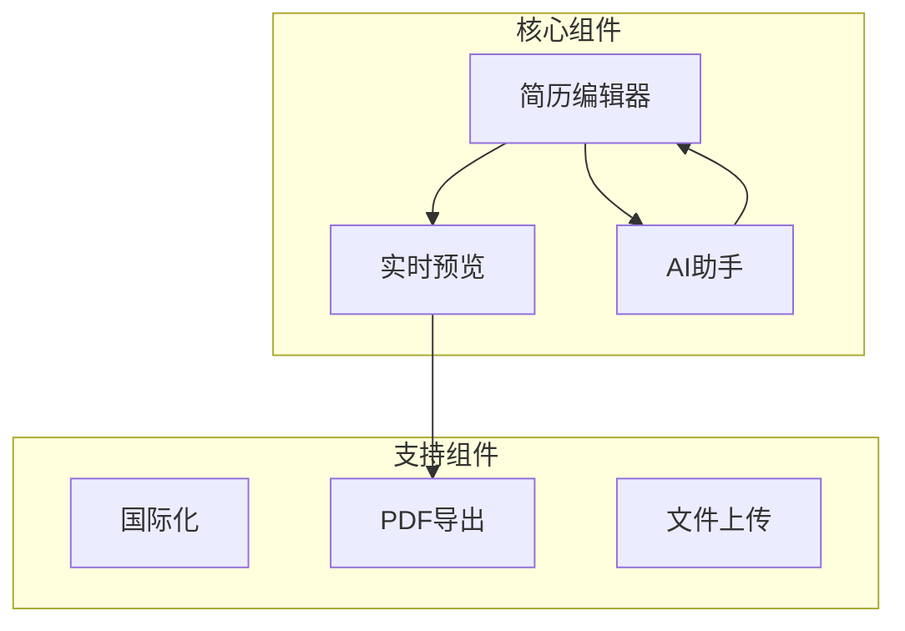
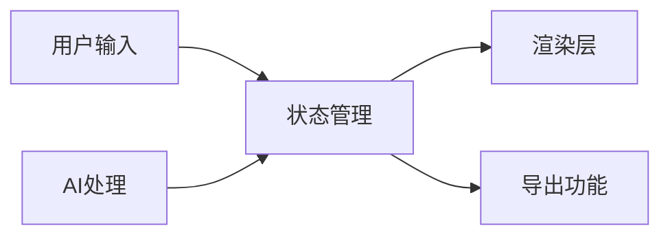

# 系统模式

## 核心架构

### 组件架构

### 数据流

## 设计模式

### 状态管理
- 使用 React Hooks 管理局部状态
- 使用自定义 Hooks 封装业务逻辑
- 组件间通过 Props 传递数据

### 组件模式
- 功能组件：实现具体业务功能
- 基础组件：提供通用UI元素
- 布局组件：处理页面结构
- 高阶组件：添加横切关注点

### API设计
- RESTful API
- API路由采用Next.js标准结构
- 统一的错误处理机制
- 类型安全的请求/响应

## 关键实现

### 编辑器实现
- 基于Monaco Editor
- 实时保存
- 语法高亮
- 代码提示

### PDF生成
- 服务端渲染
- 缓存机制
- 异步处理
- 错误重试

### 国际化
- i18next集成
- 动态语言切换
- 按需加载语言包
- 支持多语言回退

## 集成点

### 外部服务
- AI服务集成
- 文件存储服务
- 监控服务

### 内部集成
- 组件间通信接口
- 服务层调用规范
- 工具函数复用
